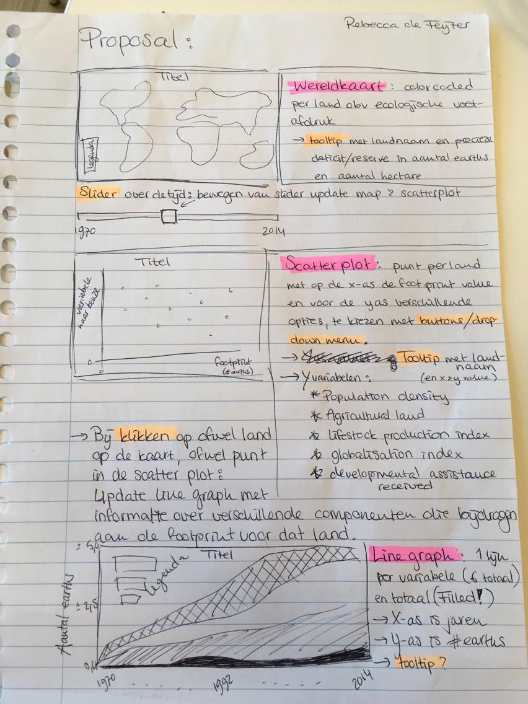

# Programmeerproject Rebecca de Feijter
# Ecological footprint and globalisation

## Projectvoorstel:
### Probleem:
Gebrek aan kennis over de groei van onze ecological footprint en het verband van factoren zoals de globalisatiegraad van landen met de ecologische voetafdruk van landen.
Doelgroep: mensen met interesse in de actuele onderwerpen klimaatverandering, milieubeleid en ontwikkelingshulp.
Doel: illustreren dat/of de ontwikkeling van landen ondanks het plezier ervan ook negatieve gevolgen heeft, namelijk voor het milieu.

### Oplossing:
Een visualisatie van de verbanden tussen globalisatie, ecologische impact en ontwikkelingshulp.
Schets hiervan met informatie over de interactieve onderdelen en dergelijke is te vinden in het mapje "doc".

### Sketch:

### Prerequisites:
#### Data sources:
- Global Footprint Network (http://data.footprintnetwork.org/#/countryTrends?cn=5001&type=earth)
- KOF Globalisation Index (https://www.kof.ethz.ch/en/forecasts-and-indicators/indicators/kof-globalisation-index.html)
Eventueel:
- World Bank Population data (https://data.worldbank.org/indicator/SP.POP.TOTL?view=chart) (of vergelijkbare sets)

#### External components:
- d3 (met tooltip en queue)
- bootstrap

#### Review:
Op zicht heb ik bij de data sources wel vergelijkbare visualisaties voorbij zien komen, maar ik weet niet hoe ze geïmplementeerd zijn.

#### Challenge:
Ik heb tot nu toe nog nooit een kaart gemaakt dus dat moet ik gaan uitvinden, en ook hoe je daarin een kleurgradiënt verwerkt. Ook vond ik het updaten van grafieken tot nu toe best moeilijk, dus het gaat wat tijd kosten om dat goed te krijgen en er liefst ook nog mooie overgangen bij te maken. Ook moet ik opletten dat ik ondervang dat er problemen ontstaan door eventuele missende data in de datasets.
