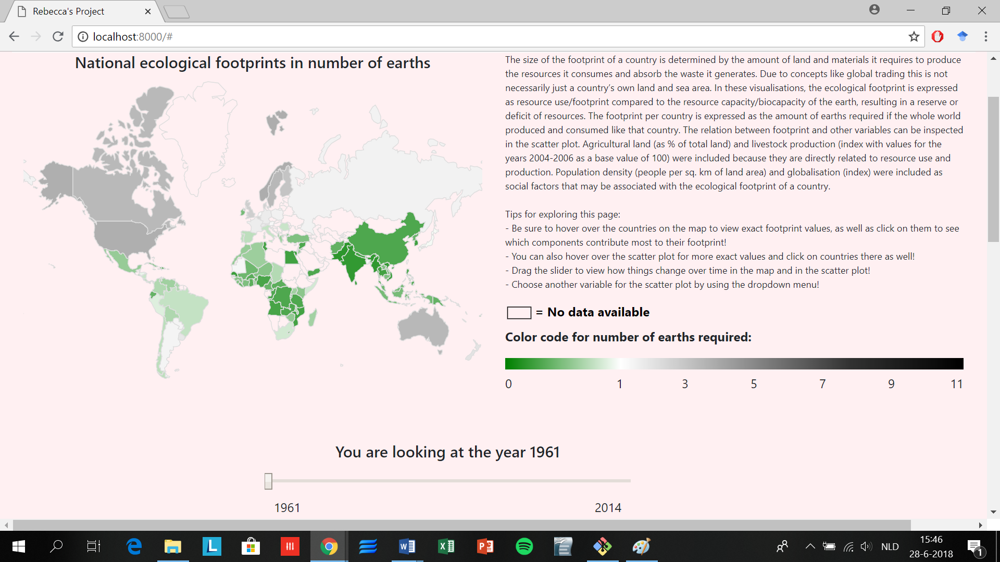
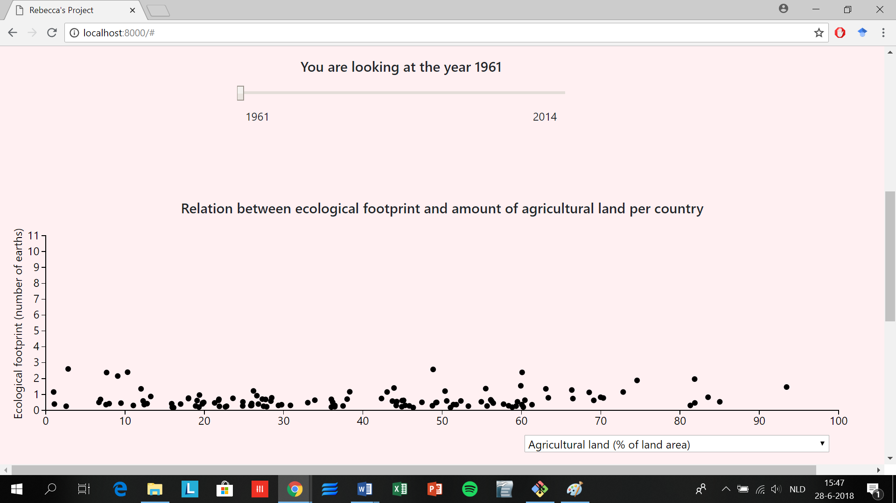
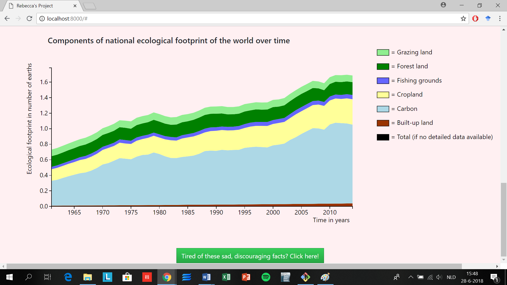

# Report:
My application contains a world map, a scatter plot and a stacked area graph.
The map is color coded based on national ecological footprint.
The scatter plot visualizes the relation between ecological footprint and other variables.
The stacked area graph visualizes how several components contributed to the ecological footprint over time.

## Technical design:
### Data conversion and transformation:
By means of convertCSV2JSON.py (in folder scripts/python) CSV's are converted into JSON files (all of these files are in the data folder).
Later on, datatransformer.js transforms the JSON's to suitable dictionary formats for the map and scatter plot visualisations.

### Files:
Main.js (in folder scripts/javascript) loads data and calls on the following other files:
- datatransformer.js (see Data conversion and transformation)
- mapmaker.js: draws and updates the world map visualisation
- scattermaker.js: draws and updates the scatter plot visualisation
- areamaker.js: draws and updates the stacked area visualisation

Furthermore, (in scripts/css) a style document footprint.css is included, as well as an html file index.html that contains several interactive html elements and the basic lay out of the page.

### Links/interaction:
- Slider: The basis of the slider is included in the html. The functions that make sure the slider updates the map and the scatter plot can be found in mapmaker.js and scattermaker.js, respectively.
- Dropdown: The basis of the dropdown menu is included in the html. The function that makes sure the scatter plot updates based on the chosen dropdown option is included in scattermaker.js.
- Clicking on a country in the map or the scatter plot will update the stacked area graph (initially displaying data for the whole world) with data for that specific country.
- Hovering over a country in either the map or the scatter plot will cause that country to light up in the other visualisation.

### Functions per file:
#### main.js:
- window.onload function
- transformData: function for organizing data returned by queue and calling functions for drawing visualisations
#### mapmaker.js:
